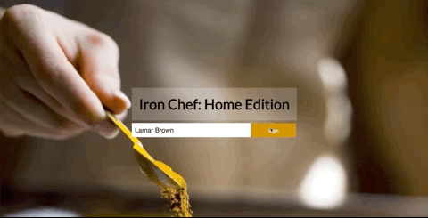

# Iron Chef: Home Addition by Virginia Ladd and Jim Weist

This app lets you be the Iron Chef and see what is available to make in your pantry. Combining JavaScript classes/vanilla JS , Mocha/Chai testing, jQuery and CSS styles into a fun and interactive way to find out what you can make for a snack, lunch, dinner ect.  

## Set Up

1. Within your group, decide on one person to have the project repository on their Github account. This person will *fork* this repository - on the top right corner of the page, click the fork button.
2. Both group members should then clone down the forked repository (make sure that everyone is added as a collaborator as well). Since you don't want your project to be named "whats-cookin-starter-kit", add an optional argument after the repo url when cloning. The command should look like this: `git clone [remote-address] [what you want to name the repo]`.
3. Once you have cloned the repo, change into the directory and install the project dependencies. Run npm install to install project dependencies.
4. Run open src/index.html in the terminal to see the HTML page (you should see some boilerplate HTML displayed on the page)
5. Make sure both members of your team are collaborators on the forked repo.
